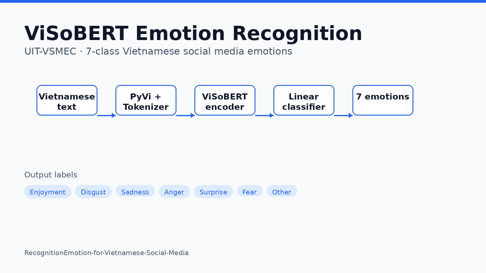

# Vietnamese Social Media Emotion Recognition (ViSoBERT + UIT-VSMEC)

Fine-tune **ViSoBERT** on the **UIT-VSMEC** corpus and run a **Streamlit** demo that classifies Vietnamese social-media sentences into seven emotion labels.



## Overview

Vietnamese social media text is informal: slang, emojis, and inconsistent diacritics make emotion recognition harder than on clean news or formal text. This repository implements a **7-way emotion classifier** on the **UIT-VSMEC** corpus (6,927 sentences from Facebook, seven emotion labels).

The main model backbone is [**ViSoBERT**](https://huggingface.co/uitnlp/visobert) (Vietnamese Social BERT), a social-media-oriented encoder. The project also includes a **PhoBERT** baseline, optional **Groq LLM** comparison in the app, training notebooks, attention visualizations, and classical deep-learning baselines under `deeplearning-models/`.

## Approach


| Label | Meaning in this project |
| --- | --- |
| Enjoyment | Positive / happy affect |
| Sadness | Sorrow, disappointment |
| Anger | Frustration, hostility |
| Surprise | Unexpected reactions |
| Fear | Anxiety, worry |
| Disgust | Aversion |
| Other | Neutral or ambiguous |

**Training (ViSoBERT):** `visobert-classification-for-vietnamese-text.ipynb` fine-tunes a BERT-style encoder with a linear classification head on UIT-VSMEC splits (`UIT-VSMEC/train.csv`, `valid.csv`, `test.csv`). **PhoBERT** follows the parallel notebook `phobert-classification-for-vietnamese-text.ipynb`.

**Inference app:** `main.py` loads fine-tuned weights from paths in `.env`, tokenizes with Hugging Face checkpoints (`5CD-AI/Vietnamese-Sentiment-visobert` or `vinai/phobert-base`), and predicts one of the seven labels.

## Results

Reported test-set metrics for this project (ViSoBERT on UIT-VSMEC):

| Model | Accuracy | Weighted F1 | Macro F1 |
| --- | ---: | ---: | ---: |
| **ViSoBERT** | **66%** | **66%** | **64%** |
| PhoBERT (baseline, `report.txt`) | 62% | 62% | 59% |

Per-class precision/recall for both models are in [`report.txt`](report.txt).

## Repository layout

```
.
├── main.py                          # Streamlit emotion classifier
├── requirements.txt                 # Python dependencies
├── UIT-VSMEC/                       # Train / valid / test splits (CSV + JSON)
├── visobert-classification-for-vietnamese-text.ipynb
├── phobert-classification-for-vietnamese-text.ipynb
├── inference.ipynb                  # Notebook inference examples
├── visualize_attention.ipynb        # BERTviz attention plots
├── visualize_wrong.ipynb            # Error analysis
├── wrong_predictions.csv
├── deeplearning-models/             # RNN / LSTM / GRU baselines
├── phobert/                         # Copy of PhoBERT training notebook
├── visobert/                        # Copy of ViSoBERT training notebook
├── images/                          # UI assets (e.g. UIT logo)
└── docs/assets/card.png             # README / portfolio card image
```

## Setup

### 1. Clone

```bash
git clone https://github.com/dinhthienan33/RecognitionEmotion-for-Vietnamese-Social-Media.git
cd RecognitionEmotion-for-Vietnamese-Social-Media
```

### 2. Install dependencies

```bash
python -m venv .venv
source .venv/bin/activate   # Windows: .venv\Scripts\activate
pip install -r requirements.txt
pip install groq bertviz matplotlib   # used by main.py but not pinned in requirements.txt
```

### 3. Model weights (Google Drive)

Fine-tuned checkpoint files are **not** stored in this repository. Download them from Google Drive and place them on your machine:

**[Model weights folder](https://drive.google.com/drive/folders/1aoaLvEJSlU6hr2F-bB6ls085CATnckKb)**

### 4. Environment variables

```bash
cp .env.example .env
```

Edit `.env` and set:

| Variable | Purpose |
| --- | --- |
| `VISO_MODEL_PATH` | Local path to the ViSoBERT fine-tuned `.pth` (or compatible) weights |
| `PHOBERT_MODEL_PATH` | Local path to the PhoBERT fine-tuned weights |
| `GROQ_API_KEY` | Optional; only needed for the **LLM** option in the Streamlit app |

Do not commit `.env`.

## Usage

**Streamlit demo**

```bash
streamlit run main.py
```

Choose **VisoBert**, **PhoBert**, or **LLM**, enter Vietnamese phrases (one per line), and download CSV results.

**Scripts & notebooks**

- `test.py` — quick ViSoBERT inference smoke test (expects weights under `models/`).
- `savemodel.py` — example of loading weights and pushing to Hugging Face Hub.
- Training and evaluation — open the `*-classification-for-vietnamese-text.ipynb` notebooks.

## Team & credits

Course project **NLP_CS221.P12**, University of Information Technology (UIT), VNU-HCM:

- Lê Trần Gia Bảo (22520105)
- **Đinh Thiên Ân** (22520010)
- Huỳnh Trọng Nghĩa (22520003)
- Nguyễn Vũ Khai Tâm (22521293)

**Data:** UIT-VSMEC corpus (included under `UIT-VSMEC/`).  
**Pre-trained encoders:** ViSoBERT / related checkpoints on Hugging Face; PhoBERT (`vinai/phobert-base`).

## Citation

If you use UIT-VSMEC or build on this work, cite the UIT-VSMEC dataset paper and the ViSoBERT publication from their official sources. This repository does not ship a BibTeX file.

## License

License: **not yet specified** in this repository.
